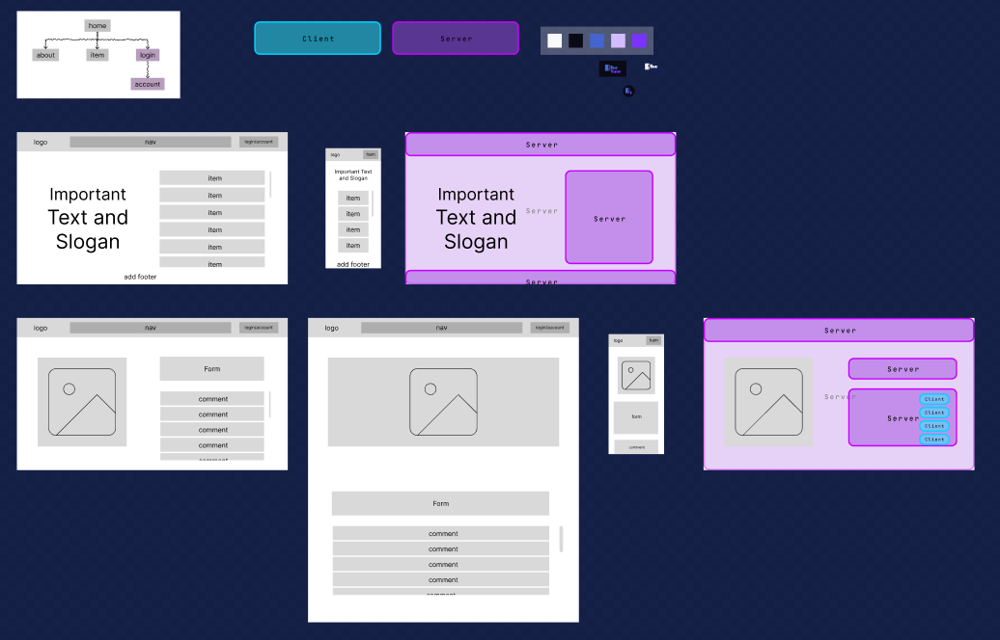
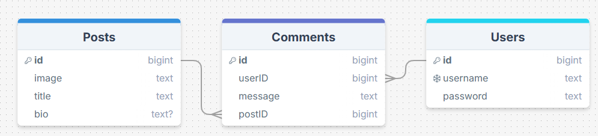

# Planning




## SQL Code

```sql
CREATE TABLE IF NOT EXISTS bv_posts (
  id    BIGINT PRIMARY KEY GENERATED ALWAYS AS IDENTITY,
  image TEXT UNIQUE NOT NULL,
  title TEXT UNIQUE NOT NULL,
  bio   TEXT
);

CREATE TABLE IF NOT EXISTS bv_users (
  id       BIGINT PRIMARY KEY GENERATED ALWAYS AS IDENTITY,
  username TEXT UNIQUE NOT NULL,
  email    TEXT UNIQUE NOT NULL,
  password TEXT NOT NULL
);

CREATE TABLE IF NOT EXISTS bv_comments (
  id      BIGINT PRIMARY KEY GENERATED ALWAYS AS IDENTITY,
  message TEXT NOT NULL,
  user_id BIGINT NOT NULL REFERENCES bv_users(id),
  post_id BIGINT NOT NULL REFERENCES bv_posts(id)
);
```

```sql
INSERT INTO bv_posts (image, title, bio)
VALUES ('pepsiman.webp', 'Pepsiman Holding Can', 'pepsiman is the left behind mascost for the pepsi brand of soda. Here, he is proudly showing you his can of pepsi, inviting you to get one as well.');

INSERT INTO bv_users (username, email, password)
VALUES ('Admin', 'thetester@admin.com', '$2b$10$7E82CCnjCWhwZ6AKt8KRWe7ejp968bKoMEHLUiytRnMR0F4/iYgmG');
```

# My Reflection

## What Went Well

- I successfully implemented everything I put time into
- I learnt how to use Next.js cookies and `usePathname()`
- I laid the foundation for future development
- I deployed to vercel and have not had any issues
- I successfully used `@theme` to use my variables in Tailwind

## What Went Worse

- I failed to implement some of the requirements (i.e. sorting, saving and deleting) within the timeframe
- I did not do as much styling as I would have Liked
- I have made no effort to account for mobile usage in my development
- there is no theme changer (only system preference), which my last project had

# To Conclude

I can see myself developing this site in the future to make it better and better over time, since it focuses on something I am consistently passionate about.
